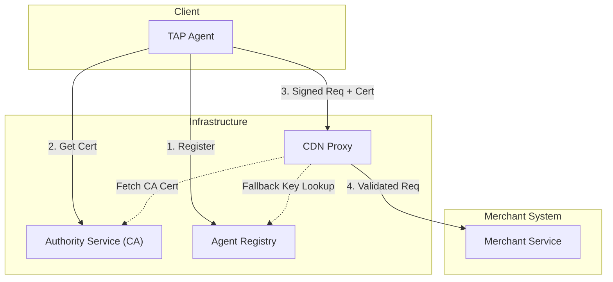
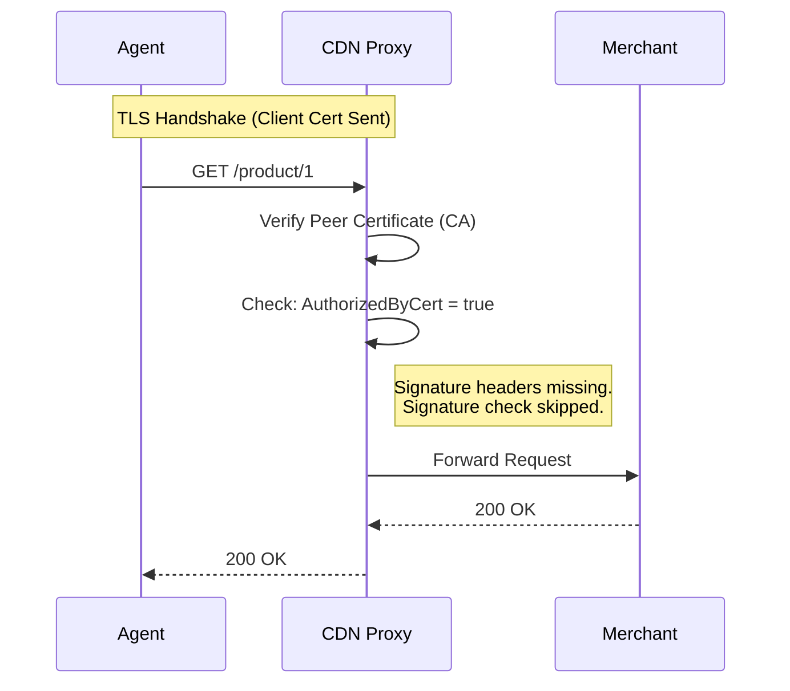
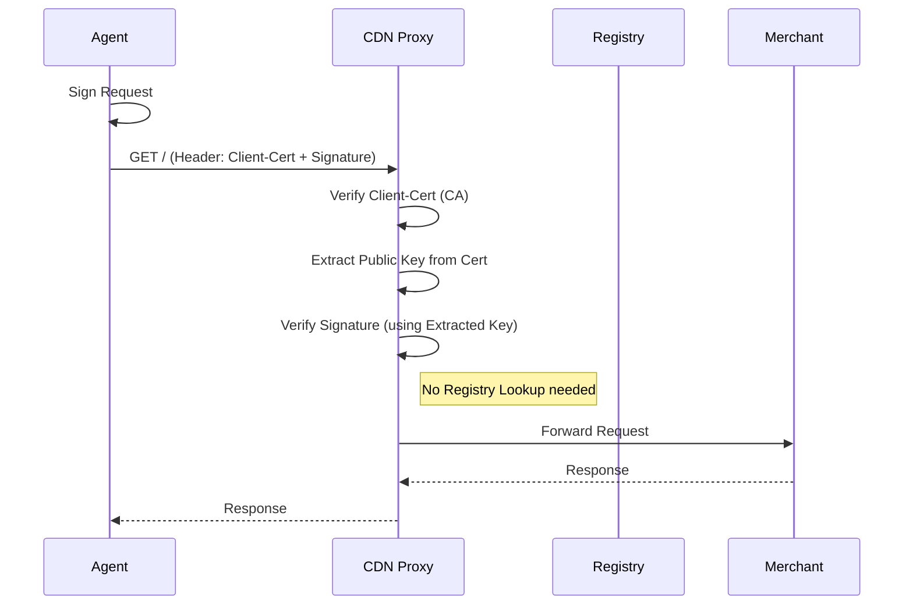
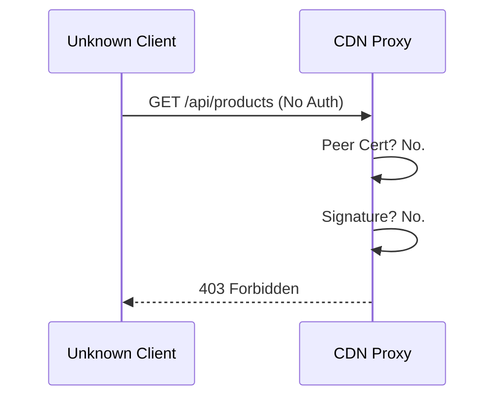

# System Architecture & Protocol Description

## System Overview
The Trusted Agent Protocol (TAP) system consists of five main components designed to facilitate secure, authenticated interactions between AI Agents and Merchant systems using RFC 9421 HTTP Message Signatures and mTLS/Certificate-based identity. The architecture enforces identity verification at the edge (CDN Proxy) before traffic reaches the Merchant application.

**Tech Stack:**
- **Runtime:** Bun
- **Language:** TypeScript
- **UI:** VanJS (No .html files)
- **Signatures:** Standard HTTP Signatures via `@interledger/http-signature-utils` with JWK.
- **PKI:** node-forge for Certificate Authority and CSR operations.

## Components

### 1. TAP Agent (Client)
- **Role**: The end-user acting as an autonomous agent.
- **Functionality**:
  - Generates cryptographic keys (Ed25519, RSA-PSS) stored as JWKs.
  - Registers identity with the **Agent registry**.
  - Requests a Client Certificate from the **Authority Service**.
  - Authenticates via **HTTP Signatures** (RFC 9421) AND **Client Certificates** (RFC 9440 header or mTLS).

### 2. CDN Proxy (Edge Security)
- **Role**: Gatekeeper / Reverse Proxy.
- **Logic**:
  - Intercepts **all** incoming traffic.
  - **Authentication**:
    - Checks `Client-Cert` header or mTLS peer certificate.
    - Validates certificate against **Authority CA**.
    - If valid cert: Extracts Public Key from cert (Optimization: skips Registry lookup).
    - If no cert: Queries **Agent Registry** for Public Key.
  - **Verification**:
    - Verifies RFC 9421 `Signature` using the resolved Public Key.
  - Forwards valid requests to **Merchant Service**.

### 3. Agent Registry (Identity Provider)
- **Role**: Storage for Agent Identities and Public Keys.
- **Logic**:
  - Exposes API for Agent and Key registration.
  - Supports multiple storage backends (Memory, Redis, SQLite).
  - Provides fallback public key lookup for the Proxy.

### 4. Authority Service (CA)
- **Role**: Certificate Authority.
- **Logic**:
  - Issues self-signed CA certificates.
  - Signs Certificate Signing Requests (CSRs) from Agents.
  - Provides CA certificate verification to Proxy.

### 5. Merchant Service (Application)
- **Role**: Unified Resource Server & UI Host.
- **Logic**:
  - Serves static frontend assets (VanJS).
  - Provides a read-only list of products via API.
  - Protected behind the Proxy.

---

## Protocol Flows

### 1. Registration & Provisioning
1.  **Agent** generates Key Pair (JWK).
2.  **Agent** registers with **Registry** (POST `/agents`).
3.  **Agent** generates CSR and requests certificate from **Authority** (POST `/authority/sign`).
4.  **Authority** signs CSR and returns Client Certificate.

### 2. Authenticated Request (Active Flow)
1.  **Agent** constructs request to **Proxy** (`GET /product/1`).
2.  **Agent** adds headers:
    -   `Signature-Input`, `Signature` (RFC 9421)
    -   `Client-Cert` (RFC 9440) containing the received certificate.
3.  **Proxy** receives request:
    -   Verifies `Client-Cert` against **Authority CA**.
    -   Extracts Public Key from `Client-Cert`.
    -   Verifies `Signature` using extracted key.
4.  **Proxy** forwards to **Merchant**.

## System Diagrams

### Architecture

## Test Scenarios

### 1. Pure mTLS (No Signature)
*Based on `src/proxy/test/mtls.test.ts`*
This flow demonstrates the efficiency optimization where a valid, trusted mTLS certificate allows the Agent to bypass the application-layer signature check.

### 2. Dual Auth (Cert Header + Signature)
*The standard "Defense in Depth" flow.*
The Agent provides the certificate as an HTTP Header (RFC 9440 style) and includes a signature. The Proxy uses the public key from the header certificate (after verifying it) to validate the signature, avoiding a Registry lookup.

### 3. Unauthorized Access
*Based on `src/proxy/test/unauthorized.test.ts`*
Requests missing both valid mTLS credentials and valid signatures are rejected.

