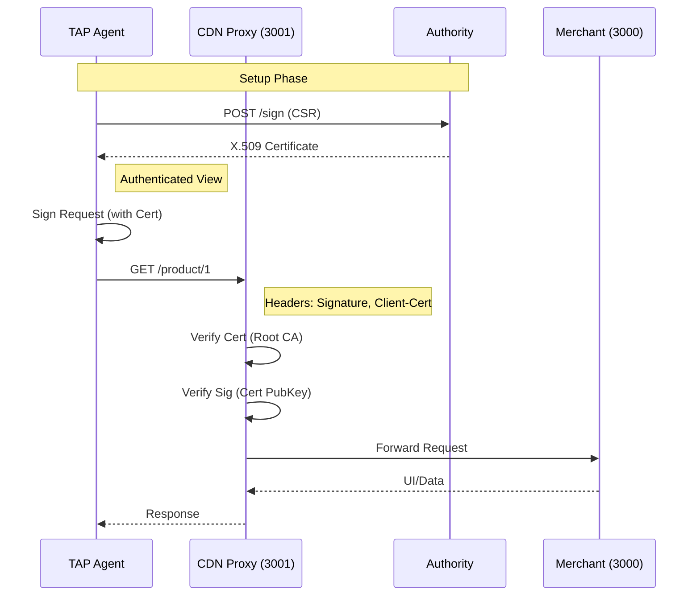

# System Architecture & Protocol Description

## System Overview
The Trusted Agent Protocol (TAP) system consists of five main components designed to facilitate secure, authenticated interactions between AI Agents and Merchant systems using RFC 9421 HTTP Message Signatures and X.509 Certificates (RFC 9440). The architecture enforces identity verification at the edge (CDN Proxy) using a certificate-based trust model.

**Tech Stack:**
- **Runtime:** Bun
- **Language:** TypeScript
- **UI:** VanJS (No .html files)
- **Signatures:** Standard HTTP Signatures via `@interledger/http-signature-utils` with JWK.

## Components

### 1. Authority (Certificate Issuer)
- **Role**: Internal Certificate Authority (CA).
- **Technology**: Bun, TypeScript, `node-forge`.
- **Functionality**:
  - Manages a Root CA key pair.
  - Exposes an endpoint (`POST /sign`) to sign Certificate Signing Requests (CSRs).
  - Issues X.509 certificates to Agents.
  - Acts as the root of trust for the Proxy.

### 2. TAP Agent (Client)
- **Role**: The end-user acting as an autonomous agent.
- **Technology**: Bun, TypeScript.
- **Functionality**:
  - Uses cryptographic keys (Ed25519, RSA-PSS) stored as JWKs.
  - Generates RFC 9421 `Signature` and `Signature-Input` headers using `@interledger/http-signature-utils`.
  - Interact with the Merchant via signed HTTP requests.

### 3. CDN Proxy (Edge Security)
- **Port**: `3001`
- **Technology**: Bun, TypeScript.
- **Role**: Gatekeeper / Reverse Proxy.
- **Logic**:
  - Intercepts **all** incoming traffic.
  - Trusts the **Authority** Root CA certificate.
  - Parses RFC 9421 headers and RFC 9440 `Client-Cert` headers.
  - **Verification**:
    - Validates the `Client-Cert` chain against the trusted Root CA.
    - Checks certificate expiration.
    - Extracts the Public Key from the validated certificate.
    - Verifies the RFC 9421 `Signature` using the extracted key.
  - Checks for replay attacks (Nonce cache).
  - Forwards valid requests to **Merchant Frontend** or **Merchant Backend**.
  - Rejects invalid requests (403 Forbidden).

### 4. Agent Registry (Identity Provider)
- **Port**: `9002`
- **Technology**: Bun, TypeScript.
- **Role**: Directory of Agents (Legacy/Onboarding).
- **Logic**:
  - Exposes API for Agent registration.
  - (Optional) Can facilitate CSR forwarding or initial agent bootstrapping.

### 5. Merchant Service (Application)
- **Port**: `3000`
- **Technology**: Bun, TypeScript.
- **Role**: Unified Resource Server & UI Host.
- **Logic**:
  - Serves static frontend assets (VanJS).
  - Provides a read-only list of products via API (`/api/products`).
  - No database (In-memory static data).
  - Receives traffic via the CDN Proxy.

---

## API Reference

### Agent Registry (Port 9002)
| Method | Endpoint | Description |
|--------|----------|-------------|
| `GET` | `/` | Health check |
| `POST` | `/agents/register` | Register or update an agent |
| `GET` | `/agents/{agent_id}` | Get agent details |
| `GET` | `/agents` | List all agents |
| `DELETE` | `/agents/{agent_id}` | Deactivate an agent |
| `GET` | `/keys/{key_id}` | **Critical**: Direct public key lookup by ID (Used by Proxy) |
| `POST` | `/agents/{agent_id}/keys` | Add a key to an agent |
| `GET` | `/agents/{agent_id}/keys/{key_id}` | Get specific key details |

### CDN Proxy (Port 3001)
*Acts as a middleware.*
| Method | Endpoint | Description |
|--------|----------|-------------|
| `GET` | `/test-proxy` | Diagnostic endpoint (Bypasses signature check) |
| `REQ` | `/product/*` | **Secured**: Enforces Signature Verification |
| `*` | `/*` | Proxies ALL traffic to Merchant Service (3000) |

### Merchant Service (Port 3000)
| Method | Endpoint | Description |
|--------|----------|-------------|
| `GET` | `/` | Serves Static UI (index.html/js) |
| `GET` | `/api/products` | List all products (Static) |
| `GET` | `/api/products/{id}` | Get product details (Static) |

---

### Protocol Flows

#### 1. Authenticated Browse (Active Flow)
*The primary flow verifying the Trusted Agent Protocol.*

1.  **Agent (Bun/TS)**:
    -   Generates Key Pair (if new).
    -   Generates CSR -> sends to **Authority** (`POST /sign`).
    -   Receives Signed X.509 Certificate.
    -   Generates headers:
        -   `Client-Cert`: `:<Base64 DER Cert>:`
        -   `Signature-Input`: `sig1=("@method" "@target-uri" "content-digest" "authorization");created=...`
        -   `Signature`: `sig1=:...:`
    -   Navigates to `http://localhost:3001/product/1`.

2.  **CDN Proxy (Edge)**:
    -   Intercepts request to `/product/1`.
    -   Extracts `Client-Cert`.
    -   **Verifies Certificate** against internal Trusted Root CA.
    -   Extracts Public Key from Certificate.
    -   **Verifies Signature** using extracted key.
    -   *If Valid*: Forwards request to **Merchant Service** (`localhost:3000`).
    -   **Merchant Service** serves the UI or API response.

## System Diagrams

### Active Runtime Flow



## Internal Architecture

```mermaid
graph TD
    subgraph "Client Side"
        Agent["TAP Agent (Bun/TS)"]
        Agent -->|Generates Sig| Agent
    end

    subgraph "Infrastructure Layer"
        Proxy["CDN Proxy (Bun/TS) :3001"]
        Authority["Authority (Bun/TS)"]
        
        Proxy -.->|Trusts| Authority
    end

    subgraph "Merchant System"
        Merchant["Merchant Service (Bun/TS) :3000\n(API + Static UI)"]
    end

    Agent -->|1. Setup (CSR)| Authority
    Agent -->|2. Signed Req (+Cert)| Proxy
    Proxy -->|3. Proxy Traffic| Merchant
```
