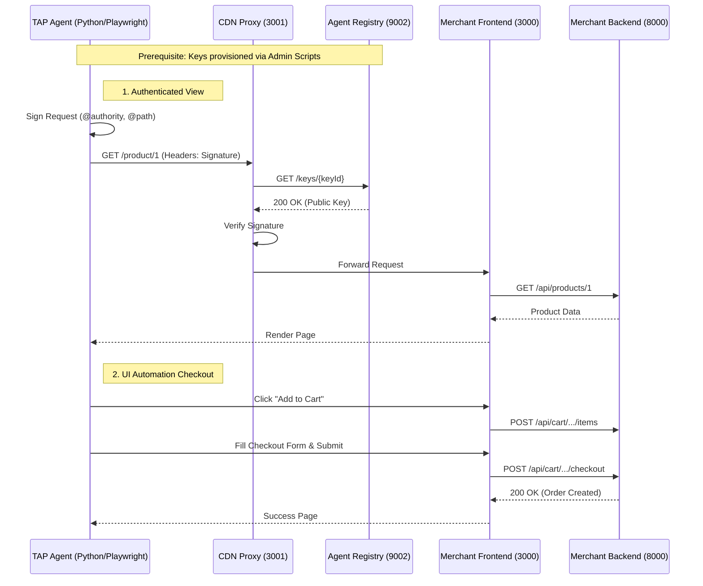
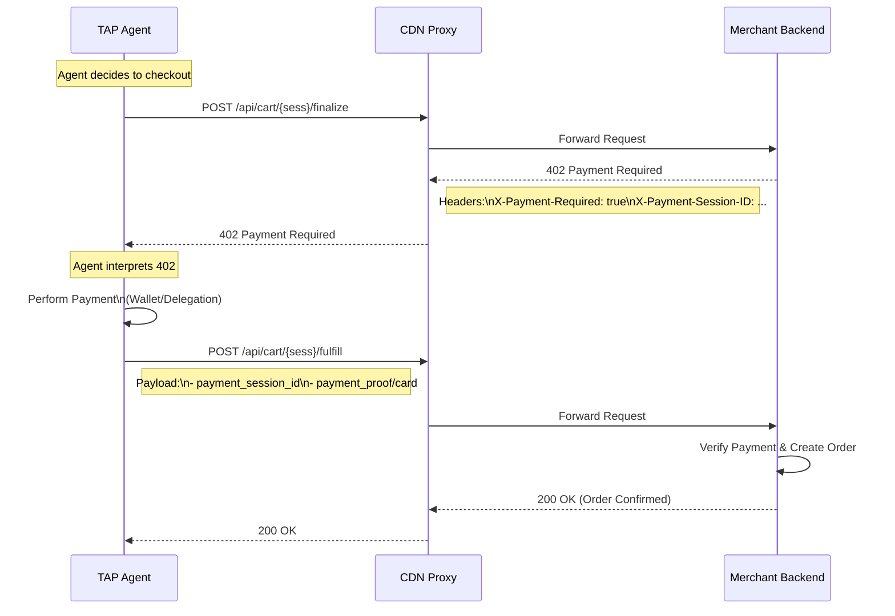
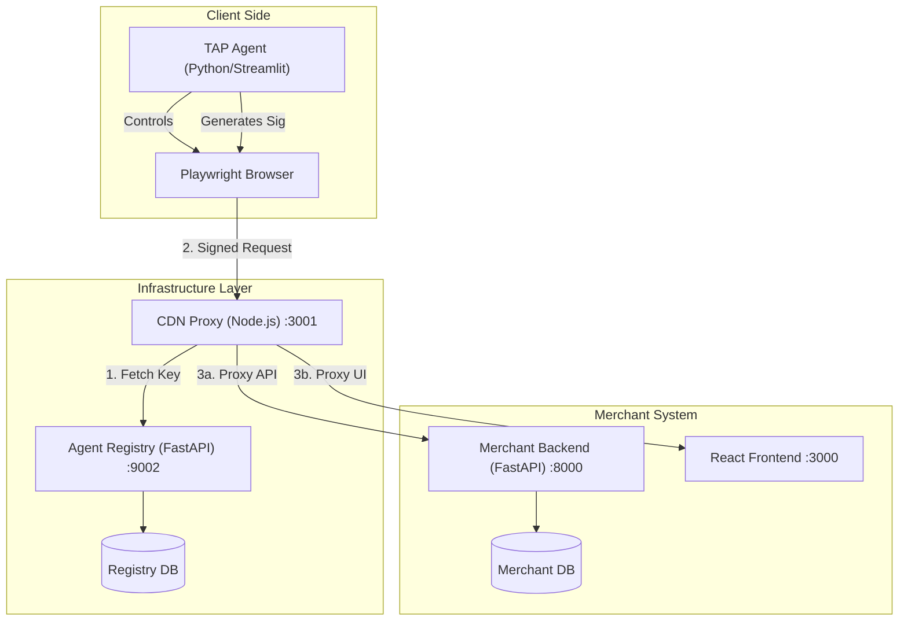

# System Architecture & Protocol Description

## System Overview
The Trusted Agent Protocol (TAP) system consists of four main components designed to facilitate secure, authenticated interactions between AI Agents and Merchant systems using RFC 9421 HTTP Message Signatures. The architecture enforces identity verification at the edge (CDN Proxy) before traffic reaches the Merchant application.

## Components

### 1. TAP Agent (Client)
- **Role**: The end-user acting as an autonomous agent.
- **Technology**: Python (Streamlit), Playwright.
- **Functionality**:
  - Uses pre-provisioned cryptographic keys (Ed25519, RSA-PSS) loaded from local `.pem` files.
  - Generates RFC 9421 `Signature` and `Signature-Input` headers.
  - Launches a browser (Playwright) to interact with the Merchant.
  - Automates product discovery and checkout flows.

### 2. CDN Proxy (Edge Security)
- **Port**: `3001`
- **Technology**: Node.js, Express.
- **Role**: Gatekeeper / Reverse Proxy.
- **Logic**:
  - Intercepts **all** incoming traffic.
  - Parses RFC 9421 headers.
  - Queries **Agent Registry** to fetch the public key associated with the `keyId`.
  - Verifies digital signatures.
  - Checks for replay attacks (Nonce cache) and expiration.
  - Forwards valid requests to **Merchant Frontend** or **Merchant Backend**.
  - Rejects invalid requests (403 Forbidden).

### 3. Agent Registry (Identity Provider)
- **Port**: `9002`
- **Technology**: Python, FastAPI, SQLite.
- **Role**: Storage for Agent Identities and Public Keys.
- **Logic**:
  - Exposes API for Agent registration (used by administrator/setup scripts).
  - Provides public API for the CDN Proxy to retrieve keys for verification.

### 4. Merchant Backend (Application)
- **Port**: `8000`
- **Technology**: Python, FastAPI, SQLite.
- **Role**: E-commerce business logic.
- **Logic**:
  - Manages Products, Carts, and Orders.
  - Implements an `x402` payment protocol for premium features/checkout.
  - Receives traffic primarily via the CDN Proxy (`/api/*`).

### 5. Merchant Frontend
- **Port**: `3000`
- **Technology**: React (assumed via Proxy config).
- **Role**: User Interface for the store.
- **Logic**:
  - Served via CDN Proxy root (`/`).

---

## API Reference (Verified via Code)

### Agent Registry (Port 9002)
| Method | Endpoint | Description |
|--------|----------|-------------|
| `GET` | `/` | Health check |
| `POST` | `/agents/register` | Register or update an agent |
| `GET` | `/agents/{agent_id}` | Get agent details |
| `GET` | `/agents` | List all agents |
| `DELETE` | `/agents/{agent_id}` | Deactivate an agent |
| `GET` | `/keys/{key_id}` | **Critical**: Direct public key lookup by ID (Used by Proxy) |
| `POST` | `/agents/{agent_id}/keys` | Add a key to an agent |
| `GET` | `/agents/{agent_id}/keys/{key_id}` | Get specific key details |

### CDN Proxy (Port 3001)
*Acts as a middleware. Routes not matching `/api` are forwarded to Port 3000.*
| Method | Endpoint | Description |
|--------|----------|-------------|
| `GET` | `/test-proxy` | Diagnostic endpoint (Bypasses signature check) |
| `REQ` | `/product/*` | **Secured**: Enforces Signature Verification |
| `*` | `/api/*` | Proxies to Merchant Backend (8000) |
| `*` | `/*` | Proxies to Merchant Frontend (3000) |

### Merchant Backend (Port 8000)
*Prefix: /api*
| Method | Endpoint | Description |
|--------|----------|-------------|
| **Products** | | |
| `GET` | `/products` | Search/List products |
| `GET` | `/products/premium/search` | **x402**: Premium search (Requires Delegation Token) |
| `GET` | `/products/{id}` | Get product details |
| `POST` | `/products` | Create product (Admin) |
| **Cart** | | |
| `POST` | `/cart` | Create new cart session |
| `GET` | `/cart/{session_id}` | Get cart contents |
| `POST` | `/cart/{session_id}/items` | Add item |
| `PUT` | `/cart/{session_id}/items/{id}` | Update quantity |
| `DELETE` | `/cart/{session_id}/items/{id}` | Remove item |
| `DELETE` | `/cart/{session_id}` | Clear cart |
| `POST` | `/cart/{session_id}/checkout` | Standard checkout |
| `POST` | `/cart/{session_id}/finalize` | **x402**: Finalize & Request Payment |
| `POST` | `/cart/{session_id}/fulfill` | **x402**: Fulfillment after payment |
| `POST` | `/cart/{session_id}/x402/checkout` | M2M x402 Checkout |
| **Orders** | | |
| `GET` | `/orders` | List orders |
| `GET` | `/orders/{id}` | Get order by ID |
| `GET` | `/orders/number/{number}` | Get order by number |
| `PUT` | `/orders/{id}/status` | Update status |
| `DELETE` | `/orders/{id}` | Cancel order |
| **Auth** | | |
| `POST` | `/auth/verify-signature` | Manual signature verification endpoint |
| `GET` | `/auth/check-verification` | Checks `x-*` headers added by Proxy |

---

### Protocol Flows (Implemented & Verified)

#### 1. Authenticated Browse (Active Flow)
*This flow is used when the Agent views the Product Details page.*

1.  **Agent (Python)**:
    -   Loads Ed25519 or RSA-PSS keys from local `.pem` files.
    -   Launches Playwright with custom HTTP headers.
    -   Generates headers:
        -   `Signature-Input`: `sig2=("@authority" "@path");keyId="primary-ed25519";...`
        -   `Signature`: `sig2=:...:`
    -   Navigates to `http://localhost:3001/product/1`.

2.  **CDN Proxy (Edge)**:
    -   Intercepts request to `/product/1`.
    -   Extracts `keyId`.
    -   Fetches Public Key from **Agent Registry** (`GET /keys/{keyId}`).
    -   Verifies Signature & Nonce.
    -   *If Valid*: Forwards request to **Merchant Frontend** (`localhost:3000`).
    -   **Merchant Frontend** calls **Merchant Backend** (`/api/products/1`).
    -   **CDN Proxy** forwards API request (signatures optional for /api paths depending on config, but enforced for /product/*).

#### 2. Standard Checkout (Active Flow)
*The current Python Agent uses standard form-filling automation.*

1.  **Agent (Playwright)**:
    -   Clicks "Add to Cart".
    -   Frontend calls `POST /api/cart/.../items`.
    -   Agent navigates to Checkout.
    -   Agent fills Credit Card form (PCI data).
    -   Agent clicks "Submit".
2.  **Merchant Frontend**:
    -   Calls `POST /api/cart/{session_id}/checkout`.
3.  **Merchant Backend**:
    -   Processes payment (Mock).
    -   Creates Order.
    -   Returns Success.

#### 3. x402 "High Assurance" Checkout (Backend Capability)
*Available in `merchant-backend` but **NOT** used by the current `tap-agent` implementation.*

-   Endpoint: `POST /api/cart/{session_id}/finalize`
-   Behavior: Returns `402 Payment Required` with `X-Payment-Session-ID`.
-   Flow: Agent would need to handle 402, perform payment, and call `/fulfill`.

## System Diagrams

### Active Runtime Flow

### High-Assurance Checkout (Backend Capability)
*This flow is fully implemented in the backend (`/finalize` -> 402 -> `/fulfill`) but **NOT** used by the current `tap-agent` code.*

## Internal Architecture

