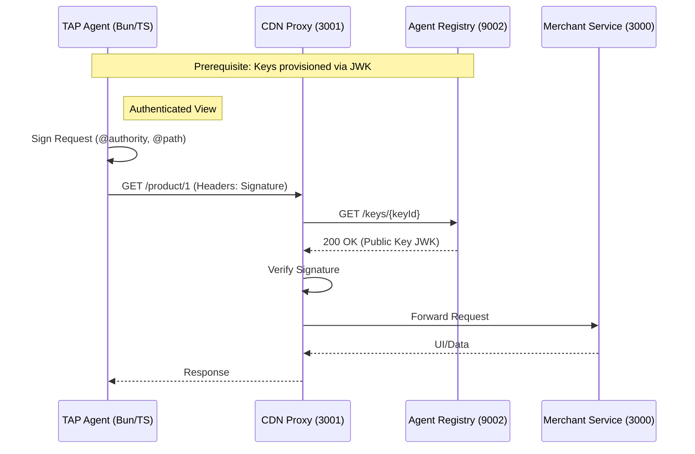
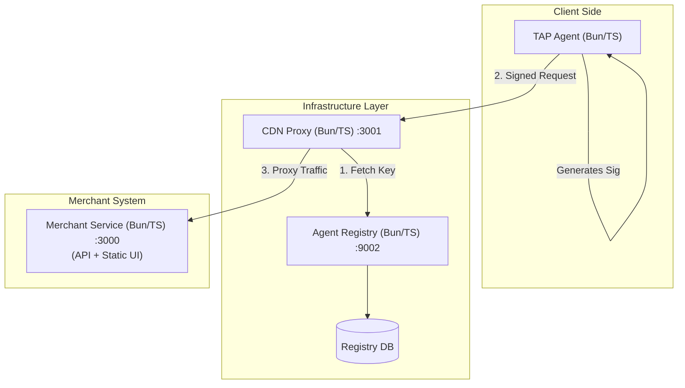

# System Architecture & Protocol Description

## System Overview
The Trusted Agent Protocol (TAP) system consists of four main components designed to facilitate secure, authenticated interactions between AI Agents and Merchant systems using RFC 9421 HTTP Message Signatures. The architecture enforces identity verification at the edge (CDN Proxy) before traffic reaches the Merchant application.

**Tech Stack:**
- **Runtime:** Bun
- **Language:** TypeScript
- **UI:** VanJS (No .html files)
- **Signatures:** Standard HTTP Signatures via `@interledger/http-signature-utils` with JWK.

## Components

### 1. TAP Agent (Client)
- **Role**: The end-user acting as an autonomous agent.
- **Technology**: Bun, TypeScript.
- **Functionality**:
  - Uses cryptographic keys (Ed25519, RSA-PSS) stored as JWKs.
  - Generates RFC 9421 `Signature` and `Signature-Input` headers using `@interledger/http-signature-utils`.
  - Interact with the Merchant via signed HTTP requests.

### 2. CDN Proxy (Edge Security)
- **Port**: `3001`
- **Technology**: Bun, TypeScript.
- **Role**: Gatekeeper / Reverse Proxy.
- **Logic**:
  - Intercepts **all** incoming traffic.
  - Parses RFC 9421 headers.
  - Queries **Agent Registry** to fetch the public key (JWK) associated with the `keyId`.
  - Verifies digital signatures using `@interledger/http-signature-utils`.
  - Checks for replay attacks (Nonce cache) and expiration.
  - Forwards valid requests to **Merchant Frontend** or **Merchant Backend**.
  - Rejects invalid requests (403 Forbidden).

### 3. Agent Registry (Identity Provider)
- **Port**: `9002`
- **Technology**: Bun, TypeScript.
- **Role**: Storage for Agent Identities and Public Keys.
- **Logic**:
  - Exposes API for Agent registration.
  - Provides public API for the CDN Proxy to retrieve keys (JWKs) for verification.

### 4. Merchant Service (Application)
- **Port**: `3000`
- **Technology**: Bun, TypeScript.
- **Role**: Unified Resource Server & UI Host.
- **Logic**:
  - Serves static frontend assets (VanJS).
  - Provides a read-only list of products via API (`/api/products`).
  - No database (In-memory static data).
  - Receives traffic via the CDN Proxy.

---

## API Reference

### Agent Registry (Port 9002)
| Method | Endpoint | Description |
|--------|----------|-------------|
| `GET` | `/` | Health check |
| `POST` | `/agents/register` | Register or update an agent |
| `GET` | `/agents/{agent_id}` | Get agent details |
| `GET` | `/agents` | List all agents |
| `DELETE` | `/agents/{agent_id}` | Deactivate an agent |
| `GET` | `/keys/{key_id}` | **Critical**: Direct public key lookup by ID (Used by Proxy) |
| `POST` | `/agents/{agent_id}/keys` | Add a key to an agent |
| `GET` | `/agents/{agent_id}/keys/{key_id}` | Get specific key details |

### CDN Proxy (Port 3001)
*Acts as a middleware.*
| Method | Endpoint | Description |
|--------|----------|-------------|
| `GET` | `/test-proxy` | Diagnostic endpoint (Bypasses signature check) |
| `REQ` | `/product/*` | **Secured**: Enforces Signature Verification |
| `*` | `/*` | Proxies ALL traffic to Merchant Service (3000) |

### Merchant Service (Port 3000)
| Method | Endpoint | Description |
|--------|----------|-------------|
| `GET` | `/` | Serves Static UI (index.html/js) |
| `GET` | `/api/products` | List all products (Static) |
| `GET` | `/api/products/{id}` | Get product details (Static) |

---

### Protocol Flows

#### 1. Authenticated Browse (Active Flow)
*The primary flow verifying the Trusted Agent Protocol.*

1.  **Agent (Bun/TS)**:
    -   Loads Keys from JWK.
    -   Generates headers:
        -   `Signature-Input`: `sig1=("@method" "@target-uri" "content-digest" "content-length" "content-type" "authorization");created=1618884473;keyid="test-key-rsa-pss"`
        -   `Signature`: `sig1=:...:`
    -   Navigates to `http://localhost:3001/product/1`.

2.  **CDN Proxy (Edge)**:
    -   Intercepts request to `/product/1`.
    -   Extracts `keyId`.
    -   Fetches Public Key (JWK) from **Agent Registry** (`GET /keys/{keyId}`).
    -   Verifies Signature & Nonce using `@interledger/http-signature-utils`.
    -   *If Valid*: Forwards request to **Merchant Service** (`localhost:3000`).
    -   **Merchant Service** serves the UI or API response.

## System Diagrams

### Active Runtime Flow

## Internal Architecture

